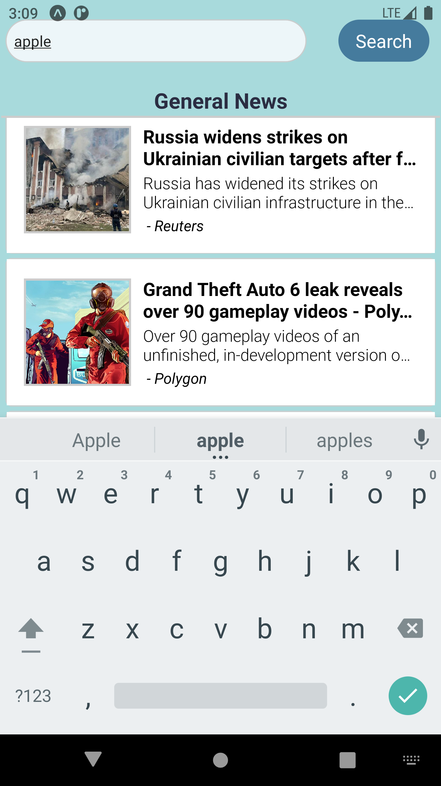

# NewsAPI Connected App

A mobile application featuring a General News screen and search term functionality. Built with React Native, Expo, Axios, and more. The app makes use of the NewsAPI (located at https://newsapi.org/). 

## Project Screen Shots

News API Application Start Screen

When the application loads it will auto-retrieve top news articles for the US in the general category.

General News Section is Scrollable

The General News section is scrollable.

News Without Images

If the news article doesn't include an image, the text will fill the space.

Search For a Keyword

In the top input box, you can enter a search term to search for news related to that term. In this example, 'apple' has been entered.

Search Results Modal

After pressing Search on the main page, the search results modal will open. Just like the General News section of the main application, this list is scrollable.

WebView Will Load

WebView has been utilized to enable webpages to open inside the modal. While the webpage is loading, a loading indicator will display.

Return to Previous Search Results List

After pressing the Cancel button at the top of the news article, the modal will close, returning you to the list of search results. Clicking the Cancel button will then return you to the General News homescreen.

## Launch Instructions

Clone this repository to your local machine. 

You will need [`npm`](https://docs.npmjs.com/downloading-and-installing-node-js-and-npm), [`expo`](https://docs.expo.dev/get-started/installation/), and [`android studio`](https://developer.android.com/studio) installed on your machine.  

After installing Android Studio, you will also need to install a virtual device. Testing for this project was done using the Pixel XL API 30 (Android 11.0).

NewsAPI API key:
This project requires an API key, and for security reasons, my key has not been saved to GitHub. Please visit NewsAPI(https://newsapi.org/) to get your own free Developer key.

NewsAPI Key Example

Please see on the left side of the VS code file folder menu, you can open Components -> newsAPI_config. Once in the file, please create a folder labeled 'API_key'. Then inside, please create a file labeled 'API_key.js'. Inside the 'API_key.js' file, please type in 'export const _api_key = '';. Inside the '', please enter the API key value provided to you when you signed up for NewsAPI.

Next, please open a terminal inside the main project folder, news.

Project Node Module Installation:

`npm install`   

To Start Expo:

`expo start`  

Expo will open a webpage located at http://localhost:19002/. 

Before you can use the application, you will need to launch Android Studio. Once you have launched it, please click on More Actions -> Virtual Device Manager. This will open a panel showing you your installed virtual phones. Please click the play button on the device and wait for the phone to load.

Once the Android Studio phone has loaded, you can return to the webpage that was generated by Expo. From there, in the menu on the left side click on 'Run on Android Device/Emulator'. The application will now run on the Android phone you launched.

**Please note that this application requires an internet connection due to relying on API data.  

## Reflection

I built this project after studying React Native in the Nucamp Full Stack Web and Mobile Application Development Bootcamp. This mini-project helped me familiarize myself with working with React Native and also how to work with an API. 

## References/Inspiration

- Pradip Debnath - "#1 - Create App UI with Native Base | News App in React Native Tutorial" - https://www.youtube.com/watch?v=0tOxrpPbx_c&list=PLQWFhX-gwJbl5sIXMZvdvGYCcZbUevE88&index=2 (Inspiration for the project itself and the use of NewsAPI, however, my application includes search functionality and a simpler UI.)